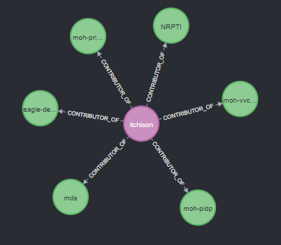
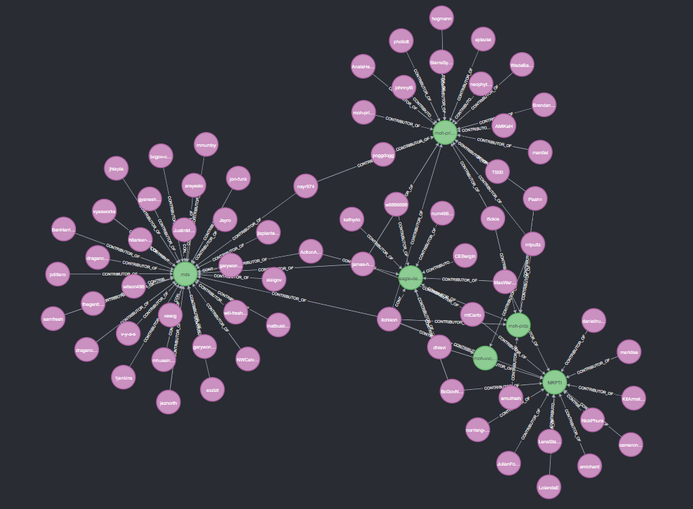

# Neo4J BC Government Graph Import
This is a neo4j database import routine for bringing in BC Government Github.

It is quick and dirty utilizing octokit for consuming the github api and then string based cypher methods to insert data.


```docker run --publish=7474:7474 --publish=7687:7687 --volume=$HOME/neo4j/data:/data neo4j```

## Configuration
This application requires two configuration values:
* GitHubToken
* neo4jpassword

The configuration can be supplied in various ways. The following list contains the configuration sources from highest to lowest priority. 
Parameters with higher priority will override those with lower priority.
1. Command line parameters
1. Environment variables
1. .env file - optional and must be in the current working directory

Change .env_example to .env and then assign a GitHub PAT and update the password for you neo4j database.

```dotnet run```

Command line examples

```dotnet run --GitHubToken=<redacted> --neo4jpassword=<redacted>```

```dotnet run /GitHubToken=<redacted> /neo4jpassword=<redacted>```

# Cool Queries and examples

## Get all repositories that a user has worked on

```
MATCH (c:Person)-[r:CONTRIBUTOR_OF]->(repos)
where c.name='itchison' 
RETURN *
```


## Get all respositories that a user has worked on and their contributors

```
MATCH (c:Person)-[r:CONTRIBUTOR_OF]->(repos)<-[m:CONTRIBUTOR_OF]-(people) 
where c.name='itchison' 
RETURN *
```


## Other cool queries

There is a list of queries [here](coolqueries.txt) that showcase other functionality of neo4j.